# Biểu đồ Cơ sở dữ liệu (ERD) - Ứng dụng Quản lý Nhiệm vụ và Chat Nhóm

## 1. Tổng quan

Biểu đồ cơ sở dữ liệu (ERD) dưới đây mô tả cấu trúc cơ sở dữ liệu Room trong ứng dụng Android. Cơ sở dữ liệu được thiết kế theo kiến trúc offline-first, cho phép người dùng làm việc ngay cả khi không có kết nối mạng và đồng bộ hóa dữ liệu khi có kết nối.

## 2. Biểu đồ ERD

```mermaid
erDiagram
    User ||--o{ PersonalTask : "tạo"
    User ||--o{ Team : "sở hữu"
    User ||--o{ TeamMember : "là thành viên"
    User ||--o{ Message : "gửi"
    User ||--o{ TeamInvitation : "nhận/gửi"
    User ||--o{ MessageReaction : "tạo"
    User ||--o{ MessageReadStatus : "đánh dấu"
    User ||--o{ Notification : "nhận"
    User ||--o{ NotificationSettings : "cấu hình"
    User ||--o{ CalendarEvent : "tham gia"
    User ||--o{ Document : "tải lên"
    User ||--o{ DocumentPermission : "được cấp quyền"
    User ||--o{ DocumentVersion : "tạo phiên bản"
    User ||--o{ UserInteraction : "tương tác"
    
    Team ||--o{ TeamMember : "có"
    Team ||--o{ TeamTask : "chứa"
    Team ||--o{ Message : "chứa"
    Team ||--o{ TeamInvitation : "tạo"
    Team ||--o{ KanbanBoard : "có"
    Team ||--o{ Document : "chứa"
    Team ||--o{ DocumentFolder : "chứa"
    Team ||--o{ TeamDocument : "chứa"
    Team ||--o{ TeamRoleHistory : "ghi lại"
    Team ||--o{ CalendarEvent : "tổ chức"
    
    KanbanBoard ||--o{ KanbanColumn : "chứa"
    KanbanColumn ||--o{ KanbanTask : "chứa"
    
    Document ||--o{ DocumentVersion : "có"
    Document ||--o{ DocumentPermission : "có"
    DocumentFolder ||--o{ Document : "chứa"
    DocumentFolder ||--o{ DocumentFolder : "chứa con"
    
    Message ||--o{ MessageReaction : "có"
    Message ||--o{ MessageReadStatus : "có"
    Message ||--o{ Attachment : "đính kèm"
    
    AppSettings ||--|| User : "cấu hình cho"

    User {
        string id PK
        string name
        string email
        string avatar
        string serverId
        string syncStatus
        long lastModified
        long createdAt
    }
    
    PersonalTask {
        string id PK
        string title
        string description
        long dueDate
        int priority
        boolean isCompleted
        string serverId
        string syncStatus
        long lastModified
        long createdAt
    }
    
    Team {
        string id PK
        string name
        string description
        string ownerId FK
        string createdBy
        string serverId
        string syncStatus
        long lastModified
        long createdAt
    }
    
    TeamMember {
        string id PK
        string teamId FK
        string userId FK
        string role
        long joinedAt
        string invitedBy
        string serverId
        string syncStatus
        long lastModified
        long createdAt
    }
    
    Message {
        string id PK
        string teamId FK
        string senderId FK
        string receiverId FK
        string content
        long timestamp
        string serverId
        string syncStatus
        long lastModified
        long createdAt
        boolean isDeleted
        boolean isRead
        string clientTempId
    }
    
    MessageReaction {
        string id PK
        string messageId FK
        string userId FK
        string reaction
        string serverId
        long lastModified
    }
    
    MessageReadStatus {
        string id PK
        string messageId FK
        string userId FK
        long readAt
        string serverId
        string syncStatus
        long lastModified
    }
    
    TeamInvitation {
        string id PK
        string teamId FK
        string teamName
        string email
        string role
        string status
        string token
        long createdAt
        long expiresAt
        string serverId
        string syncStatus
        long lastModified
    }
    
    Notification {
        string id PK
        string serverId
        string type
        string title
        string body
        map data
        long readAt
        long createdAt
        string syncStatus
        long lastModified
    }
    
    NotificationSettings {
        string userId PK,FK
        boolean taskAssignments
        boolean taskUpdates
        boolean taskComments
        boolean teamMessages
        boolean teamInvitations
        boolean quietHoursEnabled
        string quietHoursStart
        string quietHoursEnd
        string syncStatus
        long lastModified
    }
    
    TeamTask {
        string id PK
        string teamId FK
        string title
        string description
        string assignedUserId FK
        long dueDate
        int priority
        boolean isCompleted
        string serverId
        string syncStatus
        long lastModified
        long createdAt
    }
    
    CalendarEvent {
        string id PK
        string title
        string description
        long startDate
        long endDate
        string type
        string teamId FK
        string teamName
        list participants
        string serverId
        string syncStatus
        long lastModified
    }
    
    KanbanBoard {
        string id PK
        string name
        string teamId FK
        string serverId
        string syncStatus
        long lastModified
    }
    
    KanbanColumn {
        string id PK
        string name
        string boardId FK
        int order
        string serverId
        string syncStatus
        long lastModified
    }
    
    KanbanTask {
        string id PK
        string columnId FK
        string assignedToId FK
        string title
        string description
        long dueDate
        int priority
        string serverId
        string syncStatus
        long lastModified
    }
    
    DocumentFolder {
        string id PK
        string name
        string description
        string teamId FK
        string parentFolderId FK
        string createdBy FK
        long createdAt
        long updatedAt
        string syncStatus
        boolean isDeleted
        string serverId
    }
    
    Document {
        string id PK
        string name
        string description
        string teamId FK
        string folderId FK
        string fileUrl
        string fileType
        long fileSize
        string uploadedBy FK
        long uploadedAt
        long lastModified
        string accessLevel
        string allowedUsers
        string syncStatus
        boolean isDeleted
        string serverId
        string latestVersionId
        string thumbnailUrl
    }
    
    DocumentVersion {
        string id PK
        string documentId FK
        int versionNumber
        string fileUrl
        long fileSize
        string uploadedBy FK
        long uploadedAt
        string changeNotes
        string syncStatus
        string serverId
    }
    
    DocumentPermission {
        string id PK
        string documentId FK
        string userId FK
        string permissionType
        string grantedBy FK
        long grantedAt
        string syncStatus
        string serverId
    }
    
    TeamDocument {
        string id PK
        string teamId FK
        string name
        string description
        string fileUrl
        string fileType
        long fileSize
        string uploadedBy FK
        long uploadedAt
        string accessLevel
        string syncStatus
        boolean isDeleted
        string serverId
    }
    
    TeamRoleHistory {
        string id PK
        string teamId FK
        string userId FK
        string oldRole
        string newRole
        string changedBy FK
        long changedAt
        string syncStatus
        string serverId
    }
    
    UserInteraction {
        long id PK
        string user_id FK
        string interaction_type
        int interaction_count
        long last_interaction_timestamp
    }
    
    AppSettings {
        int id PK
        string current_user_id FK
        string theme_mode
        boolean notification_enabled
        long last_sync_timestamp
    }
    
    Attachment {
        string id PK
        string messageId FK
        string fileName
        long fileSize
        string fileType
        string url
        string serverId
        string syncStatus
        long createdAt
    }
```

## 3. Mô tả các bảng chính

### 3.1. User
Lưu trữ thông tin người dùng, bao gồm tên, email và avatar.

### 3.2. Team
Lưu trữ thông tin về các nhóm, bao gồm tên, mô tả và người sở hữu.

### 3.3. TeamMember
Lưu trữ thông tin về thành viên trong nhóm, bao gồm vai trò và thời gian tham gia.

### 3.4. Message
Lưu trữ tin nhắn trong cuộc trò chuyện nhóm, bao gồm nội dung, người gửi và thời gian.

### 3.5. PersonalTask
Lưu trữ nhiệm vụ cá nhân của người dùng, bao gồm tiêu đề, mô tả, thời hạn và mức độ ưu tiên.

### 3.6. TeamTask
Lưu trữ nhiệm vụ của nhóm, bao gồm tiêu đề, mô tả, người được giao và thời hạn.

### 3.7. KanbanBoard, KanbanColumn, KanbanTask
Lưu trữ thông tin về bảng Kanban, cột và nhiệm vụ trong bảng Kanban.

### 3.8. Document, DocumentFolder, DocumentVersion, DocumentPermission
Lưu trữ thông tin về tài liệu, thư mục, phiên bản và quyền truy cập tài liệu.

## 4. Đặc điểm của cơ sở dữ liệu

- **Offline-first**: Mỗi bảng đều có trường `syncStatus` để theo dõi trạng thái đồng bộ hóa với server.
- **Unique ID**: Mỗi bảng đều có ID duy nhất để hỗ trợ đồng bộ hóa giữa thiết bị và server.
- **Timestamp**: Các bảng đều có trường `lastModified` và `createdAt` để theo dõi thời gian tạo và cập nhật.
- **Soft Delete**: Một số bảng có trường `isDeleted` để hỗ trợ xóa mềm, giúp đồng bộ hóa dễ dàng hơn.
