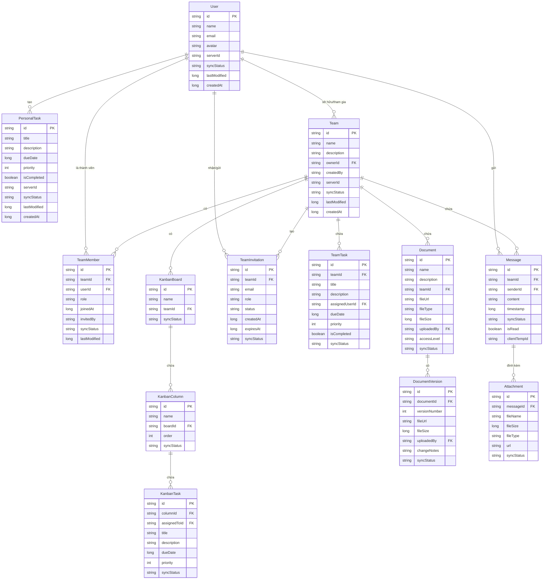

# Biểu đồ Cơ sở dữ liệu (ERD) đơn giản hóa - Ứng dụng Quản lý Nhiệm vụ và Chat Nhóm

## 1. Tổng quan

Biểu đồ cơ sở dữ liệu (ERD) dưới đây là phiên bản đơn giản hóa, tập trung vào các bảng chính và mối quan hệ quan trọng nhất trong ứng dụng. Cơ sở dữ liệu đầy đủ có 24 bảng, nhưng để dễ hiểu và phù hợp với báo cáo, chúng tôi chỉ hiển thị 12 bảng cốt lõi.

## 2. Biểu đồ ERD đơn giản hóa

## 3. Mô tả các bảng chính

### 3.1. User
Lưu trữ thông tin người dùng, bao gồm tên, email và avatar.

### 3.2. Team
Lưu trữ thông tin về các nhóm, bao gồm tên, mô tả và người sở hữu.

### 3.3. TeamMember
Lưu trữ thông tin về thành viên trong nhóm, bao gồm vai trò và thời gian tham gia.

### 3.4. Message
Lưu trữ tin nhắn trong cuộc trò chuyện nhóm, bao gồm nội dung, người gửi và thời gian.

### 3.5. PersonalTask
Lưu trữ nhiệm vụ cá nhân của người dùng, bao gồm tiêu đề, mô tả, thời hạn và mức độ ưu tiên.

### 3.6. TeamTask
Lưu trữ nhiệm vụ của nhóm, bao gồm tiêu đề, mô tả, người được giao và thời hạn.

### 3.7. KanbanBoard, KanbanColumn, KanbanTask
Lưu trữ thông tin về bảng Kanban, cột và nhiệm vụ trong bảng Kanban.

### 3.8. Document và DocumentVersion
Lưu trữ thông tin về tài liệu và các phiên bản của tài liệu.

### 3.9. TeamInvitation
Lưu trữ thông tin về lời mời tham gia nhóm.

### 3.10. Attachment
Lưu trữ thông tin về tệp đính kèm trong tin nhắn.

## 4. Đặc điểm của cơ sở dữ liệu

- **Offline-first**: Mỗi bảng đều có trường `syncStatus` để theo dõi trạng thái đồng bộ hóa với server.
- **Unique ID**: Mỗi bảng đều có ID duy nhất để hỗ trợ đồng bộ hóa giữa thiết bị và server.
- **Timestamp**: Nhiều bảng có trường `lastModified` và `createdAt` để theo dõi thời gian tạo và cập nhật.
- **Mối quan hệ phức tạp**: Cơ sở dữ liệu có nhiều mối quan hệ phức tạp giữa các bảng, phản ánh tính năng phong phú của ứng dụng.

## 5. Lưu ý

Biểu đồ này là phiên bản đơn giản hóa của cơ sở dữ liệu đầy đủ (24 bảng). Các bảng và thuộc tính đã được lựa chọn để thể hiện các chức năng cốt lõi của ứng dụng, phù hợp cho việc trình bày trong báo cáo.
